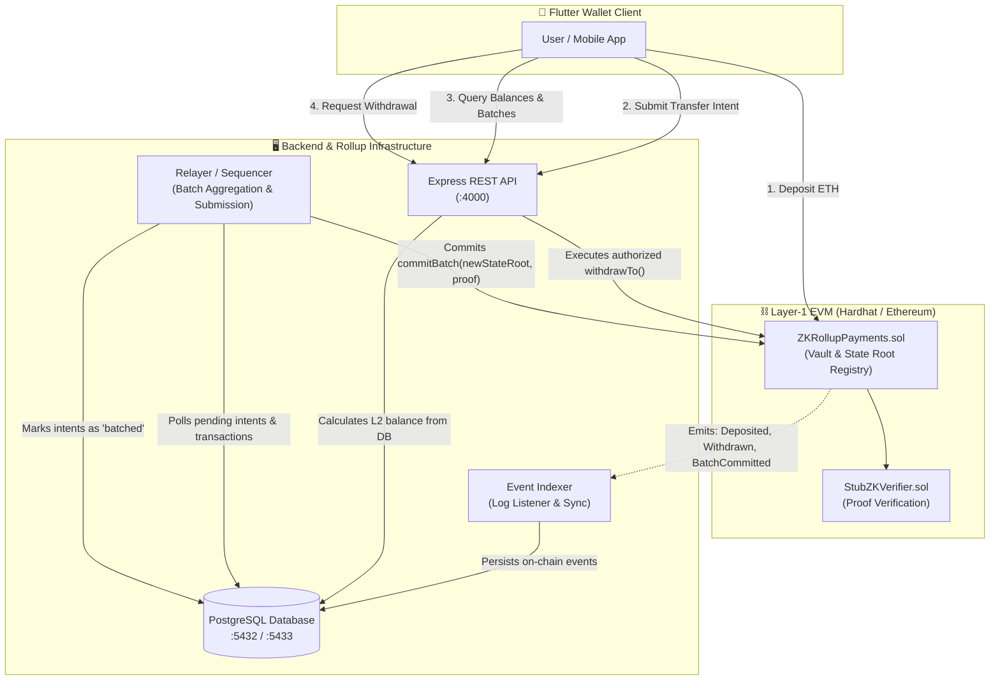

# ⚡ ZK Pay Wallet

**ZK Pay Wallet** is a high-performance, modular Zero-Knowledge (ZK) Rollup payment ecosystem designed for near-instant, low-fee Ethereum transfers. It combines scalable off-chain payment batching with cryptographic Layer-1 (L1) settlement, an automated event indexer, a dedicated relayer service, a robust REST backend, and a modern cross-platform Flutter wallet application.

---

## 📑 Table of Contents

- [Overview](#-overview)
- [Architecture & System Design](#-architecture--system-design)
  - [System Flow Diagram](#system-flow-diagram)
  - [Core Components](#core-components)
- [End-to-End Lifecycles](#-end-to-end-lifecycles)
  - [1. Deposit Flow (L1 → L2)](#1-deposit-flow-l1--l2)
  - [2. Instant Off-Chain Transfer (L2 Payments)](#2-instant-off-chain-transfer-l2-payments)
  - [3. Batch Settlement & State Transitions](#3-batch-settlement--state-transitions)
  - [4. Withdrawal Flow (L2 → L1 Exit)](#4-withdrawal-flow-l2--l1-exit)
- [Project Structure](#-project-structure)
- [Database Schema](#-database-schema)
- [REST API Reference](#-rest-api-reference)
- [Quickstart & Getting Started](#-quickstart--getting-started)
  - [Prerequisites](#prerequisites)
  - [Option A: Docker Compose (All-in-One)](#option-a-docker-compose-all-in-one)
  - [Option B: Manual / Local Setup](#option-b-manual--local-setup)
- [Running the Flutter Client](#-running-the-flutter-client)
- [Testing & Validation](#-testing--validation)
- [Roadmap to Production ZK Proving](#-roadmap-to-production-zk-proving)

---

## 🔭 Overview

Traditional Layer-1 Ethereum payment transactions suffer from high gas fees and network congestion. **ZK Pay Wallet** solves this by adopting a **Layer-2 Rollup architecture**:
- **Gas Efficiency**: Hundreds of payment intents, deposits, and withdrawals are aggregated and committed to Ethereum in a single transaction.
- **Instant Finality UX**: Off-chain balance checks and payment intents give users instant feedback while state roots are batched and verified on-chain.
- **Non-Custodial Security**: Funds reside in the smart contract vault and can only be withdrawn according to authorized state transitions or validity proofs.

---

## 🏛 Architecture & System Design

The ecosystem is composed of five interconnected layers:
1. **L1 Smart Contracts (`contracts/`)**: Solidity smart contracts deployed to an EVM network (Hardhat / Ethereum / Sepolia) managing deposits, state roots, batch commitments, and exit withdrawals.
2. **Indexer Service (`backend/src/indexer.ts`)**: Background daemon polling and indexing contract events (`Deposited`, `BatchCommitted`, `Withdrawn`) into PostgreSQL.
3. **Relayer / Sequencer Service (`backend/src/relayer.ts`)**: Automated rollup sequencer that pools pending payment intents, calculates updated state roots, generates batch hashes, and submits them to the L1 contract.
4. **Backend API Server (`backend/src/server.ts`)**: Express REST API computing accurate real-time L2 balances, handling payment intents, serving batch explorers, and managing relayer exits.
5. **Flutter Client (`flutter_app/`)**: Production-grade mobile and desktop application with secure key management, wallet onboarding, QR scanning, transfer flows, and live batch monitoring.

### System Flow Diagram



### Core Components

#### 1. Smart Contracts
- **[`ZKRollupPayments.sol`](file:///home/omni/Projects/zk-pay-wallet/contracts/ZKRollupPayments.sol)**:
  - **State Root Tracking**: Stores `currentStateRoot` and historical `batches` records.
  - **Deposits**: `deposit()` accepts native ETH and updates internal accounting.
  - **Batch Commitment**: `commitBatch(newStateRoot, batchHash, txCount, proof, publicInputs)` verifies state transitions via the pluggable verifier and updates `currentStateRoot`.
  - **Withdrawals**: Supports direct contract withdrawals, relayer-facilitated exits (`withdrawTo`), and cryptographic proof-based exits (`withdrawWithProof`).
  - **Security Controls**: Reentrancy guards (`nonReentrant`), emergency pause (`pause()` / `unpause()`), and role-based access for relayers.
- **[`StubZKVerifier.sol`](file:///home/omni/Projects/zk-pay-wallet/contracts/StubZKVerifier.sol)**:
  - Implements [`IZKVerifier`](file:///home/omni/Projects/zk-pay-wallet/contracts/interfaces/IZKVerifier.sol). Returns `true` for simulated verification during testing and local development, ready to be swapped with a production Snark/Plonk verifier.

#### 2. Event Indexer
- Continuously polls block events for `Deposited`, `BatchCommitted`, and `Withdrawn`.
- Syncs transactions with idempotency (`ON CONFLICT (tx_hash) DO NOTHING`).

#### 3. Relayer / Sequencer
- Gathers unbatched payment intents, deposits, and withdrawals using database row locks (`FOR UPDATE SKIP LOCKED`).
- Calculates batch commitment hashes:
  $$\text{batchHash} = \text{keccak256}(\text{concatenated payload IDs})$$
  $$\text{newStateRoot} = \text{keccak256}(\text{oldStateRoot} \parallel \text{batchHash})$$
- Calls `commitBatch()` on L1 and updates database status to `batched`.

#### 4. Express REST API
- Calculates verified L2 balances using the formula:
  $$\text{L2 Balance} = \sum \text{Deposits} + \sum \text{Received Intents} - \sum \text{Withdrawals} - \sum \text{Sent Intents}$$
- Validates sufficient balance before accepting new payment intents.

---

## 🔄 End-to-End Lifecycles

### 1. Deposit Flow (L1 → L2)
1. User connects wallet and invokes `deposit()` on `ZKRollupPayments.sol` sending ETH.
2. The contract emits `Deposited(user, amount, newBalance)`.
3. The **Indexer** picks up the event and writes the deposit into the `deposits` table.
4. The **Backend API** immediately reflects the updated L2 balance for the user's address.

### 2. Instant Off-Chain Transfer (L2 Payments)
1. Sender initiates a transfer to a recipient address in the Flutter app.
2. The client submits `POST /intents` with `fromAddress`, `toAddress`, and `amountWei`.
3. The API verifies the sender's current L2 balance. If sufficient, the intent is recorded in PostgreSQL with status `pending`.
4. Both sender and receiver see instant balance updates in their app.

### 3. Batch Settlement & State Transitions
1. The **Relayer** runs periodically (every 4 seconds) and retrieves up to 10 pending records.
2. It generates the new Merkle state root and submits an L1 transaction `commitBatch()`.
3. Once the transaction confirms, the batch index is logged on-chain and referenced in the `batches` table, moving intents from `pending` to `batched`.

### 4. Withdrawal Flow (L2 → L1 Exit)
1. User initiates a withdrawal from L2 back to their L1 Ethereum address.
2. The client calls `POST /withdrawals`.
3. The API verifies the user's available L2 balance and confirms the smart contract vault has sufficient ETH liquidity.
4. The relayer submits `withdrawTo(recipient, amount)` to transfer native ETH from the vault contract to the recipient on L1.

---

## 📂 Project Structure

```plaintext
zk-pay-wallet/
├── contracts/                  # Solidity smart contracts
│   ├── interfaces/
│   │   └── IZKVerifier.sol     # ZK Verifier interface
│   ├── StubZKVerifier.sol      # Mock verifier for testing/local rollup
│   └── ZKRollupPayments.sol    # Core L1 Rollup Vault contract
├── backend/                    # Node.js TypeScript Backend Services
│   ├── src/
│   │   ├── server.ts           # REST API server & balance orchestrator
│   │   ├── indexer.ts          # L1 contract event indexer
│   │   └── relayer.ts          # Rollup batching sequencer
│   ├── migrations/
│   │   └── 01-init.sql         # PostgreSQL database schema
│   ├── Dockerfile              # Backend container definition
│   └── package.json
├── flutter_app/                # Cross-platform Flutter Wallet App
│   ├── lib/
│   │   ├── app/                # Application routes and themes
│   │   ├── core/               # Constants, network clients, utilities
│   │   ├── features/           # Auth, Wallet, History, Settings, Onboarding
│   │   ├── providers/          # State management (Riverpod/Provider)
│   │   ├── services/           # API and Secure Key Storage services
│   │   └── main.dart           # App entrypoint
│   └── pubspec.yaml
├── scripts/                    # Automation & tooling
│   ├── deploy.ts               # L1 contract deployment script
│   └── validate.ts             # End-to-end integration validation suite
├── test/                       # Hardhat smart contract unit tests
│   └── ZKRollupPayments.test.ts
├── deployments/                # Saved contract addresses and network config
│   └── addresses.json
├── docker-compose.yml          # Full-stack Docker orchestration
├── hardhat.config.ts           # Hardhat configuration
├── package.json                # Root package configuration
└── tsconfig.json               # TypeScript configuration
```

---

## 🗄 Database Schema

The database runs on PostgreSQL (`rollup_db`). Schema definitions are located in [`backend/migrations/01-init.sql`](file:///home/omni/Projects/zk-pay-wallet/backend/migrations/01-init.sql):

- **`payment_intents`**: Stores L2 off-chain transactions.
  - Columns: `id (UUID)`, `from_address`, `to_address`, `amount_wei`, `status ('pending'|'batched')`, `batch_id`, `created_at`, `updated_at`.
- **`batches`**: Tracks rollup state transitions committed on-chain.
  - Columns: `id`, `batch_index`, `old_state_root`, `new_state_root`, `batch_hash`, `tx_count`, `relayer_address`, `committed_at`, `tx_hash`.
- **`deposits`**: Indexed L1 deposits.
  - Columns: `id`, `user_address`, `amount_wei`, `tx_hash`, `block_number`, `indexed_at`, `batch_id`.
- **`withdrawals`**: Indexed L1 exits.
  - Columns: `id`, `user_address`, `amount_wei`, `tx_hash`, `block_number`, `indexed_at`, `batch_id`.

---

## 🌐 REST API Reference

The backend API server listens by default on port `4000`.

| Method | Endpoint | Description | Request Body / Params |
| :--- | :--- | :--- | :--- |
| `POST` | `/intents` | Submit a new L2 payment intent | `{ "fromAddress": "0x...", "toAddress": "0x...", "amountWei": "100000000000000000" }` |
| `GET` | `/intents` | List payment intents | Query: `?address=0x...&status=pending` |
| `GET` | `/deposits/:address` | Get total calculated L2 balance | Path: `:address` |
| `POST` | `/withdrawals` | Request an L2 → L1 withdrawal | `{ "userAddress": "0x...", "amountWei": "50000000000000000" }` |
| `GET` | `/withdrawals/:address` | Get user withdrawal history | Path: `:address` |
| `GET` | `/batches` | List all committed rollup batches | None |
| `GET` | `/batches/:batchIndex` | Get batch details with intents & deposits | Path: `:batchIndex` |
| `GET` | `/state` | Get current state root & contract address | None |

---

## 🚀 Quickstart & Getting Started

### Prerequisites
- [Docker](https://docs.docker.com/get-docker/) & Docker Compose
- [Node.js](https://nodejs.org/) v20+ and `npm`
- *(Optional for mobile development)* [Flutter SDK](https://docs.flutter.dev/get-started/install) v3.19+

---

### Option A: Docker Compose (All-in-One)

The simplest way to run the entire backend and blockchain stack is via `docker-compose`:

```bash
# 1. Clone repository
git clone https://github.com/SudheerKondamuri/zk-pay-wallet.git
cd zk-pay-wallet

# 2. Build and start all services
docker compose up --build
```

This will automatically:
1. Start an EVM node (`hardhat`) at `http://localhost:8545`.
2. Start PostgreSQL at `localhost:5433`.
3. Compile and deploy `StubZKVerifier.sol` & `ZKRollupPayments.sol`.
4. Generate `deployments/addresses.json`.
5. Run migrations and start the **REST API** (`localhost:4000`), **Indexer**, and **Relayer**.

To stop services:
```bash
docker compose down -v
```

---

### Option B: Manual / Local Setup

If you prefer to run services individually for active development:

#### 1. Install Root & Backend Dependencies
```bash
# Install root Hardhat dependencies
npm install

# Install backend dependencies
cd backend && npm install && cd ..
```

#### 2. Start Local Blockchain Node
```bash
npx hardhat node
```

#### 3. Deploy Smart Contracts
In a new terminal:
```bash
npx hardhat run scripts/deploy.ts --network localhost
```
*This deploys contracts and outputs `deployments/addresses.json`.*

#### 4. Start PostgreSQL Database
```bash
docker run --name zk-postgres -e POSTGRES_PASSWORD=password -e POSTGRES_DB=rollup_db -p 5432:5432 -d postgres:15-alpine
```

#### 5. Start Backend Services
In separate terminal windows:

```bash
# Start API Server (Runs DB migrations on boot)
cd backend
npm run build
npm start

# Start Indexer
npm run start:indexer

# Start Relayer / Sequencer
npm run start:relayer
```

---

## 📱 Running the Flutter Client

The Flutter application provides a sleek mobile/desktop interface for interacting with your local or remote rollup network.

```bash
cd flutter_app

# 1. Fetch Flutter dependencies
flutter pub get

# 2. Run the application
# For Chrome / Web:
flutter run -d chrome

# For Linux Desktop:
flutter run -d linux

# For Connected Android / iOS Device or Emulator:
flutter run
```

> **Configuration Note**: The app connects by default to `http://localhost:4000` (or `http://10.0.2.2:4000` on Android emulators). Update endpoint constants in [`flutter_app/lib/core/`](file:///home/omni/Projects/zk-pay-wallet/flutter_app/lib/core) if deploying against a remote server.

---

## 🧪 Testing & Validation

### 1. Smart Contract Unit Tests
Runs the full Mocha/Chai test suite validating reentrancy, pause controls, deposit accounting, batch commitments, and relayer security:

```bash
npx hardhat test
```

### 2. End-to-End Automated Validation Suite
Execute the automated integration test script that performs real deposits, verifies indexer sync, tests invalid/valid payment intents, checks relayer batch settlement, and produces `validation_report.json`:

```bash
npx hardhat run scripts/validate.ts --network localhost
```

---

## 🔐 Roadmap to Production ZK Proving

The repository is structured to facilitate direct replacement of `StubZKVerifier.sol` with cryptographic zero-knowledge circuits:

1. **Circom / SnarkJS Circuit**:
   - Construct a Merkle tree constraint circuit proving validity of transaction signatures, state transitions ($S_i \to S_{i+1}$), nonces, and balance conservation.
2. **On-Chain Verifier Contract**:
   - Compile the Circom circuit to generate a Solidity verifier contract implementing `IZKVerifier.sol`.
3. **Off-Chain Prover Service**:
   - Integrate `snarkjs` or `rapidsnark` into `relayer.ts` to compute witness and Groth16/Plonk proofs during batch creation and pass the proof payload to `commitBatch()`.

---

## 📜 License

This project is licensed under the [ISC License](file:///home/omni/Projects/zk-pay-wallet/package.json).
